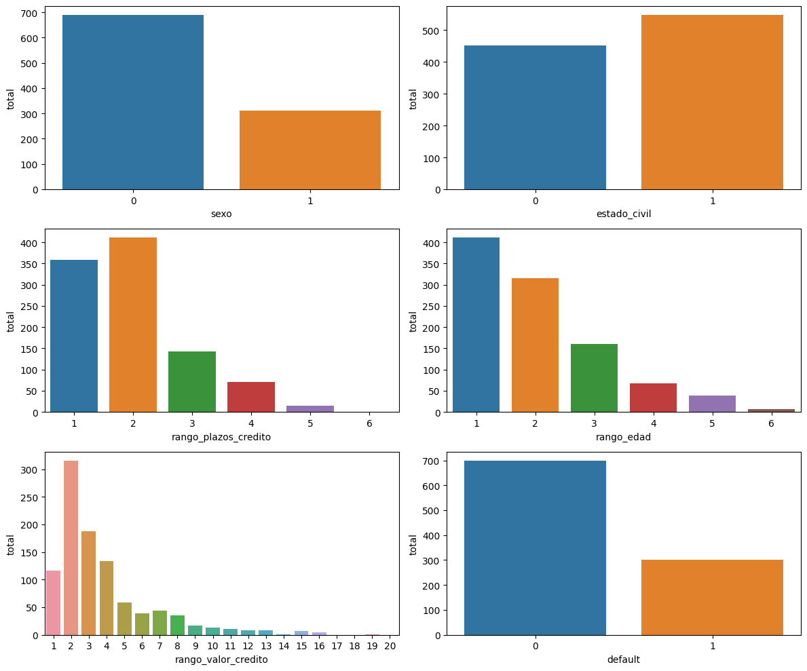
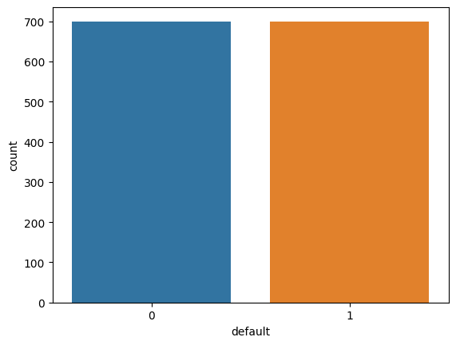
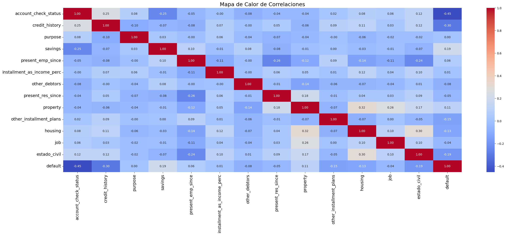
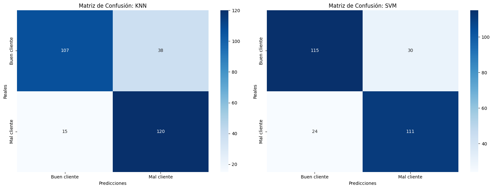
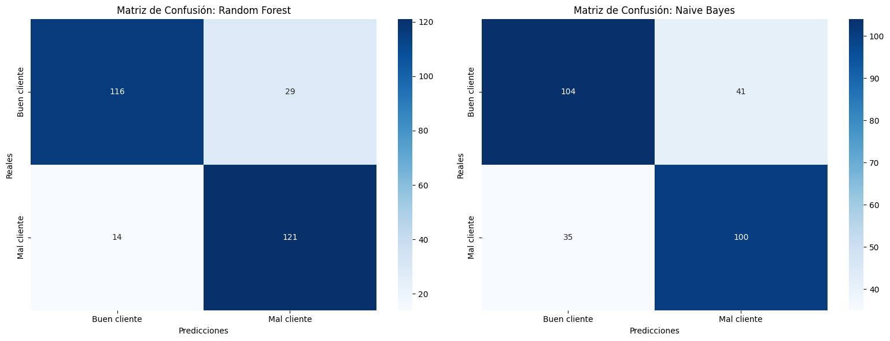
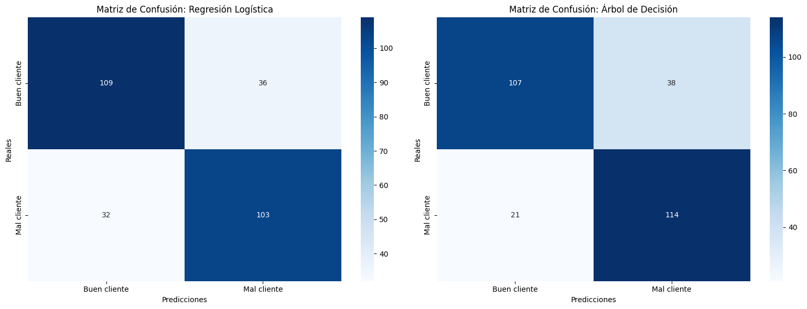
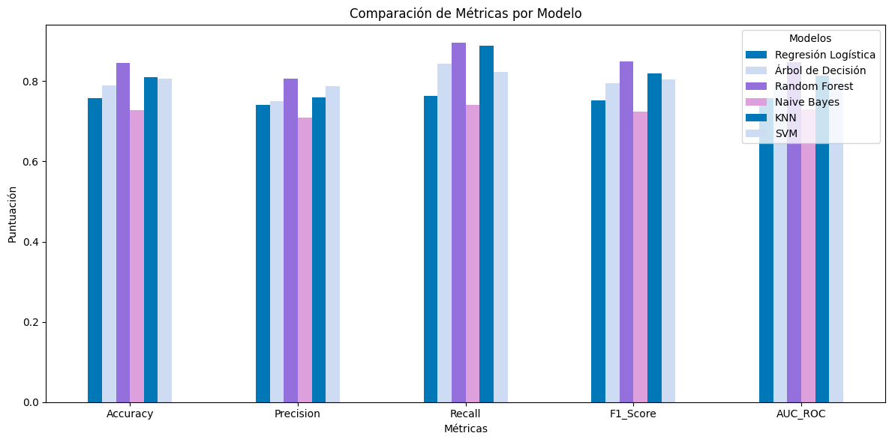

# Credit Score Prediction
Equipo 11: Gerardo de la Cruz, Dave Bautista, José Ruiz

La importancia de reducir el riesgo crediticio ha llevado a una institución financiera alemana a buscar soluciones innovadoras. Como científicos de datos, hemos sido convocados para construir un modelo de machine learning preciso y confiable que sea capaz de evaluar con mayor precisión la probabilidad de incumplimiento crediticio de sus clientes.

### **Actividades Principales:**

**1. Preprocesamiento de Datos:** Realizar limpieza de datos, manejar valores faltantes, codificación de variables categóricas y normalización/escalado de datos.

**2. Exploración de Datos:** Analizar y comprender el conjunto de datos proporcionado, identificar variables llaves y realizar visualizaciones para entender las relaciones entre las variables y seleccionar las características relevantes.

**3. Construcción de Modelos:** Experimentar con algunos algoritmos de machine learning como Regresión Logística, Árboles de Decisión, Random Forest, Naive Bayes, entre otros.

**4. Evaluación y Selección del Modelo:** Evaluar los modelos utilizando métricas como precisión, recall, área bajo la curva ROC, y F1-score. Seleccionar el modelo con el mejor rendimiento para la predicción de la solvencia crediticia.

## Resultados
### Visualización y Balanceo de Clases
Una vez preprocesados los datos, se realizaron los siguientes gráficos de algunas características que parecieron relevantes del Dataframe.

Es importante mencionar que fue necesario hacer un balanceo de las clases para obtener mejores resultados.

### Mapa de Calor
El siguiente mapa de correlación nos indica que tan relacionadas están las variables unas con otras. Cabe mencionar que se descartaron algunas variables no tan importantes del conjunto de datos original, esto con la finalidad de lograr un mejor modelo.

###               Matrices de Confusión

Se probaron diferentes modelos de Machine Learning, los cuales se pueden observar los resultados de estos a continuación.

### Comparación de Modelos

Parece ser que los modelos con mejores métricas resultan ser Random Forest Classifier y KNN.

## Conclusiones

#### En este proyecto de machine learning el modelo con las mejores métricas fue Random Forest Classifier, obteniendo un Accuracy: 0.846 y Precisión: 0.807. El cual lo hace el modelo con mejores métricas para este proyecto de clasificación de potenciales buenos y malos clientes. Como se observa en la matriz de confusión, RFC es el modelo que menos se equivoca en general al clasificar a los clientes.
